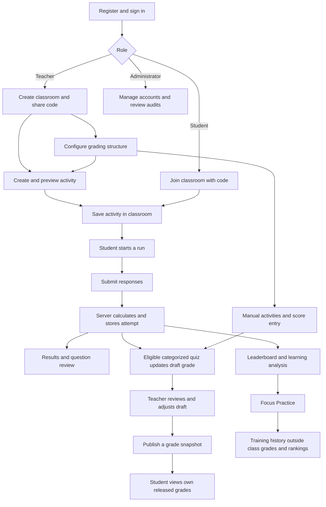

# CHALK / QuizWeb: System Workflow, Game Mechanics, and Grading

This guide describes the implementation reviewed and enhanced on October 5, 2026. It follows the PHP controllers, shared services, and JavaScript game engines in this repository. Examples illustrate the implemented formulas; they are not mandatory school grading policies. Automated backend/DOM checks and source-based browser fixtures were tested; authenticated live PostgreSQL workflows remain unverified.

## Contents

1. System purpose and roles
2. Overall workflow
3. Accounts and access
4. Classroom workflow
5. Teacher activity creation
6. Student play and submission
7. Game mechanics by mode
8. Scores, accuracy, and leaderboards
9. Classroom grading
10. Results and learning support
11. Communication and materials
12. Administration
13. Storage and processing
14. Complete classroom example
15. Current behavior and limitations
16. Source map

## 1. System purpose and roles

CHALK is a classroom learning and assessment application. Teachers organize classrooms, create game-based activities, distribute materials, review performance, and release grades. Students enroll using classroom codes, complete activities, inspect their results, and practice weak questions. Administrators manage account status and inspect operational and academic audit records.

There are three separate measures of performance:

| Measure | What it represents | How it changes |
| --- | --- | --- |
| Attempt score | Points earned in one activity run | A new run creates a new stored attempt |
| Leaderboard | Competitive comparison of selected best runs | Recomputed from classroom attempts |
| Classroom grade | Teacher-configured academic result | Calculated from categorized activities, manual scores, policies, and adjustments |

A saved game can count for the leaderboard while remaining outside academic grading. A teacher's grade adjustment does not rewrite the original game score.

## 2. Overall workflow



Activity availability and grade publication are separate events. Saving an activity makes it accessible through the classroom; publishing grades releases a calculated academic snapshot.

## 3. Accounts and access

### Registration

1. Choose Student or Teacher. Public registration does not offer Administrator.
2. Enter a full name, valid email, password, and confirmation.
3. Supply the required profile information.
4. Submit the form. The server checks the form token, role, field validity, password requirements, and email uniqueness.
5. After account creation, sign in.

Passwords require at least eight characters, including a letter and a number. The system hashes passwords rather than storing them as readable text.

Student profiles require student number, birthdate, gender, program/course, and year level. For other roles, birthdate and gender are required while the academic profile fields are optional. Birthdates must be valid dates between January 1, 1900 and today. Profile Settings updates these profile fields; its current form does not change the account's name, email, password, or role.

### Sign-in and authorization

The application uses PHP sessions to identify the signed-in user. Protected routes require authentication and, where applicable, a particular role. A teacher must own the classroom they are editing. A student must be enrolled to access its activities. A student can view their own classroom attempt; the classroom's teacher can review student attempts.

Suspended accounts cannot continue normal authenticated access. Account status and authorization are enforced server-side, not only through hidden navigation links.

## 4. Classroom workflow

### Teacher creates a classroom

1. Open the teacher dashboard.
2. Enter a classroom name and subject; optionally add a description.
3. Save. The server creates a classroom linked to that teacher.
4. Share its unique six-character join code.
5. Open the classroom to manage activities, announcements, materials, results, and grades.

The generated code uses uppercase hexadecimal characters and is checked for uniqueness. Each classroom stores its enrolled student IDs, quizzes, announcements, and chat data.

### Student joins a classroom

1. Open Join Class.
2. Enter the teacher's code.
3. The server trims and uppercases the input, looks up the classroom, and checks existing membership.
4. An invalid code produces an error. Joining the same classroom twice also produces an error.
5. A successful join adds the student to the roster and opens the classroom.

Classroom Overview, Quizzes, Materials, and Results use separate addressable tab views. All Classes opens the classroom directory. The Grades area has separate teacher and student workflows.

## 5. Teacher activity creation

### Builder sequence

The compact wizard separates Game → Details → Questions → Settings → Grading → Review. Saving is the final action. Only the selected question is expanded; navigation, duplication, and reordering keep the current form values. Local drafts are stored after edits where browser storage is available, and a subsequent visit offers Restore or Discard. Local recovery does not save to PostgreSQL.

1. Open a classroom and select Create Quiz Game.
2. Select a template. The primary choices include Standard Quiz, Crossword, Flip Match, Fill in the Blank, Emoji Quiz, and Mastery Ladder. Additional themed multiple-choice modes appear under More game styles.
3. Enter a title and optional description.
4. Set an optional deadline and mode-specific settings.
5. Add the questions, words, or pairs.
6. Set each item's points and difficulty label.
7. Decide whether the activity is academically graded. The default is Not graded / Practice activity.
8. If graded, select an existing grade category, a gradebook maximum, and an attempt policy.
9. Use Preview Activity to validate and inspect the unsaved draft.
10. Review and save. Successful saving returns to the classroom's Quizzes view.

### Validation rules

| Content | Implemented rules |
| --- | --- |
| General activity | Between 1 and 40 items; required title up to 255 bytes |
| Question points | Converted to integers and constrained to 5–1,000 |
| Multiple choice | Required prompt and four nonblank choices; one correct index from 0–3; the saved question retains four choices |
| Difficulty | Easy, Medium, Hard, or Master; unknown labels fall back to Easy |
| Mastery Ladder | At least one question in every difficulty level; target from 50% to 100%, default 75% |
| Crossword | At least three distinct normalized words; each 3–15 letters; all words must fit a connected grid |
| Written-answer activities | Required prompt and main answer; up to 20 alternative answers; optional case sensitivity, hint, and explanation |
| Flip Match | 2–12 pairs with distinct terms and distinct definitions |
| Grade maximum | 0.01–100,000, with at most two decimal places |

The written-answer validator uses byte-length limits: 2,000 for prompts, 250 for main answers, 2,000 for hints, and 8,000 for explanations. Its hint/explanation error message expresses smaller character limits, so the displayed wording and backend byte thresholds are not identical.

### Two preview paths

**Unsaved preview:** The builder sends the current form to the server for validation. Nothing is saved and no attempt is recorded. Crossword uses the same deterministic layout generator as saving, with Across/Down clues and an optional answer key. Other previews show content for inspection; Flip Match previews show pair content.

**Saved playable preview:** The teacher opens Preview on an existing activity and plays its game engine. Results are shown locally without creating a student attempt or leaderboard entry.

### Editing an existing quiz

The application preserves historical interpretation. New attempts store a complete quiz snapshot. Before replacing an older quiz, the save service adds the old version to any earlier attempts that lack a snapshot. The classroom quiz update and grade-item synchronization occur within one transaction.

## 6. Student play and submission

1. Open a classroom quiz or an activity listed under Game Modes.
2. The server verifies enrollment and finds the quiz.
3. It creates a session run token associated with the student, classroom, quiz, and quiz snapshot.
4. The page loads the appropriate JavaScript engine.
5. Start the activity and answer its questions or complete its puzzle.
6. Finish, inspect the short completion state, and select View Results to submit. The request includes responses, elapsed time, classroom/quiz identifiers, a form token, and the run token.
7. The server validates access and the run token, then grades using the run's stored quiz snapshot.
8. It writes an attempt with earned points, maximum points, answers, elapsed seconds, and timestamp.
9. The student is redirected to the result page.

Repeating a submission for a run token that already has an attempt redirects to that existing result. Expired or mismatched tokens are rejected. The server recomputes the score from responses; it does not accept the browser's displayed score as the final grade.

## 7. Game mechanics by mode

### Shared multiple-choice mechanics

Standard Quiz, Time Attack, Rocket Rush, Memory Flip, Treasure Dive, Boss Battle, and Mastery Ladder share the older game engine. Each question has four options. A correct response adds that question's points, increments the correct-answer count, and extends the streak. A wrong response or timeout earns zero and resets the streak. Feedback identifies correct and incorrect choices before the player continues.

The streak and best streak are feedback statistics. They do not multiply points. Elapsed time does not provide a score bonus or deduction. Difficulty labels do not automatically multiply points; teachers set the points separately.

| Mode | Actual behavior |
| --- | --- |
| Standard Quiz | Sequential multiple-choice questions without a per-question countdown |
| Time Attack | Twelve seconds for each question; timeout records a wrong response; countdown restarts for the next item |
| Rocket Rush | Themed multiple-choice run with space visuals; keyboard shortcuts 1–4 select choices |
| Memory Flip | Multiple-choice answers presented as animated cards; it does not implement the term/definition matching rules of Flip Match |
| Treasure Dive | Underwater presentation and themed feedback with ordinary question-point scoring |
| Boss Battle | Correct answers damage boss health; incorrect answers damage player shield; either reaching zero can end the run early |
| Mastery Ladder | Easy → Medium → Hard → Master, with level accuracy controlling progression |

Number-key answer shortcuts are implemented by the shared engine, so they are available beyond Rocket Rush when choice buttons are active.

### Boss Battle

Boss health and player shield begin at 100. Damage per answer is:

```text
damage = max(4, ceil(100 / number_of_questions))
```

Correct answers reduce boss health; wrong answers reduce shield. Values stop at zero. The run can finish when the boss is defeated, shield is exhausted, or all questions are completed.

Example: ten questions produce ten damage per response. A correct answer removes ten boss health and earns its configured points. A wrong answer removes ten shield and earns zero. Health is a game-progress measure, not an additional academic score. The four-point damage floor means a long quiz can end before every question is reached. Normal stored maximum points still include all its questions.

### Mastery Ladder

Questions are grouped in the fixed order Easy, Medium, Hard, Master. After completing one group:

```text
level_accuracy = round(correct_answers_in_level / questions_in_level × 100)
```

If that rounded accuracy reaches the teacher's target, the next level unlocks. Otherwise, the student finishes the run with later levels locked. Completing Master ends the ladder. Unlocking uses correct-question count, not weighted question points.

Example: with four Easy questions and a 75% target, three correct answers unlock Medium. Two correct answers do not. If item points differ, the point percentage may differ from the unlock percentage.

For a normal stored Mastery Ladder attempt, maximum points include only questions whose response index exists in the submitted answers. Locked, unreached questions are excluded. A disqualified run is an exception: its maximum includes the full quiz and its earned score is zero. The server grades submitted answers but does not independently replay the browser's level-unlock progression.

### Crossword Puzzle

Teachers enter words and clues and optionally request horizontal or vertical placement. Answers are normalized to uppercase A–Z letters, removing spaces, punctuation, and other characters. The generator must connect every word through valid intersections.

Students fill the grid using Across and Down clue tabs. Selecting a clue highlights its word and direction. Arrow keys navigate cells; typing advances along the selected word. Progress counts filled words, not confirmed correct words. The grid scrolls inside its own container when necessary. Student page data contains puzzle shape and word lengths; the answer key stays on the server. Submission extracts words and the server compares their normalized forms with the expected answers. A correct word earns all its points. An incomplete or incorrect word earns zero. There is no per-letter partial credit and no twelve-second countdown. Teacher preview offers a Show/Hide Answer Key control.

### Fill in the Blank and Emoji Quiz

These modes use the newer activity engine. Students type an answer, may open a supplied hint, and move between questions. A review screen lists responses and provides Edit actions before submission.

The server trims leading/trailing whitespace and compares the response against the main answer and alternatives. Comparison ignores case unless the teacher enabled case sensitivity. It does not perform fuzzy matching, accept arbitrary synonyms, or automatically ignore internal spaces and punctuation. Correct responses earn full item points; blank or incorrect responses earn zero.

Emoji Quiz uses the same text-answer rules; the teacher supplies the emoji clue and accepted concept answers. It does not automatically interpret emojis using an AI service.

### Flip Match

The engine creates two cards per pair and shuffles all cards. Each face can contain text or an uploaded image, supporting text-to-image and image-to-image matching. Descriptive text labels remain required for accessibility and scoring. Students reveal two cards at a time. Each two-card selection counts as one move.

A matching term/definition pair remains revealed and disabled. A mismatch locks further card selection and automatically turns back after 900 milliseconds; Turn Cards Back also lets the player continue sooner. After every pair is matched, Submit Matches becomes available, followed by completion and View Results. Elapsed time and moves are tracked; moves are stored with responses but do not reduce points.

Because ordinary play only offers final submission after all pairs match, a normally completed run earns full points. Time and moves communicate efficiency rather than producing a partial score.

### Fullscreen, warnings, and screenshot shortcuts

All eleven game modes use the same security controller for live student runs.
Start Activity requests browser fullscreen directly from the student's click.
The quiz stays on its start screen if fullscreen is unavailable or denied. Once
fullscreen succeeds, a CSRF-protected server request activates the run before
questions and timers become available. Teacher previews and Focus Practice are
exempt.

Leaving fullscreen, switching tabs, minimizing, and moving focus away pause the
quiz behind a warning. The interface shows the current warning count. Blur,
visibility, and fullscreen changes from one incident count once while its warning
is awaiting acknowledgement. Continue Quiz requires fullscreen again. Timed
questions pause while the warning is visible.

Violations one through three show warnings; violation four saves a zero score.
Warnings are recorded in the server session with unique event IDs, so retrying a
request cannot double-count it and starting again cannot reset the count. The
fourth violation immediately creates a disqualified attempt in PostgreSQL. A
later normal submit returns that same result. Closing or reloading an active quiz
sends an abandonment event that also saves zero. Browser termination or network
loss can prevent that event from reaching the server; this is browser monitoring,
not complete proctoring.

Print Screen and supported Windows/macOS screenshot shortcuts trigger warnings
when the browser receives their keyboard events. A website cannot reliably detect
or block every operating-system screenshot, mobile hardware capture, external
screen recorder, or photograph. A focus change caused by a capture tool can still
trigger the normal focus warning. The quiz rules explain this limitation.

Results include the server-recorded warning count and last reason. Client answers
cannot overwrite security metadata or the saved quiz snapshot. Student submissions
require a valid started run, CSRF token, membership, and the matching run token.

### Question and choice shuffling

Each student run receives a shuffled question list and shuffled multiple-choice
options. Correct indexes are remapped with the options. The server stores that
exact version in the run and grades against it; the saved attempt retains the
snapshot for later review. Classroom quiz definitions and teacher previews keep
their authored order. Mastery Ladder shuffles within each difficulty, retaining
Easy ? Medium ? Hard ? Master progression. Crossword question IDs retain their
existing grid placements even when the question list is reordered.

## 8. Scores, accuracy, and leaderboards

### Attempt score

```text
earned_points = sum(points for correctly answered items)
score_percentage = earned_points / maximum_points × 100
```

Displayed result percentages use the shared integer-rounding helper. No negative marks or extra streak points are implemented. Except for normal Mastery Ladder runs, all quiz questions contribute to the maximum, including unanswered items.

Example: question values of 10, 20, and 30 produce a maximum of 60. Correctly answering the first two gives 30/60 = 50%, although two of three questions correct is approximately 67% question accuracy. The in-game accuracy statistic and learning analytics use question counts; result percentages use points.

### Classroom leaderboard

1. Consider attempts belonging to enrolled students in the classroom.
2. For each student and quiz, choose the attempt with the highest rounded point percentage.
3. If percentages tie, prefer the shorter elapsed time.
4. Sum earned points and maximum points from those selected attempts.
5. Calculate the aggregate point percentage.
6. Sort by total earned points descending, percentage descending, quizzes played descending, elapsed time ascending, then student name.

Displayed class ranks share the same number when total points, percentage, and quizzes played match. Time and name determine order inside that tie without changing its shared rank. The attempt count counts recorded runs, not just selected best runs.

The student dashboard leaderboard compares students across the current student's enrolled classrooms. Its best-run key includes both classroom and quiz ID. It excludes disqualified attempts, sorts by points, percentage, quiz count, and name, and assigns sequential ranks. The classroom leaderboard does not explicitly filter disqualified attempts, so a zero can remain its selected run when it is the only attempt.

Gradebook attempt policies do not change leaderboard selection. An ungraded classroom activity can still contribute to rankings. Focus Training stores classroom ID zero and therefore stays outside these classroom comparisons.

## 9. Classroom grading

### A. Configure the grading structure

The teacher opens Grades and completes Categories → Weights → Grade Scale → Review.

The configuration supports:

- One to eight categories with unique names and stable IDs.
- Weights from 0% to 100%, totaling exactly 100%.
- One to ten grade-scale bands with unique labels and minimums.
- A first scale band starting at zero.
- A passing percentage from 0% to 100%.
- A missing-score policy of Exclude or Zero.

The implemented calculation method is weighted categories, with points-based calculations inside each category. There is no fixed universal passing threshold or letter scale: the teacher configures both.

### B. Connect a quiz to grading

In builder Settings, select a configured category. Set a grade maximum or let the first save use the total question points. Choose an attempt policy:

| Policy | Selected result |
| --- | --- |
| Highest | Highest eligible unrounded point percentage; ties retain the earlier sorted attempt |
| Latest | Most recent eligible attempt, ordered by played timestamp then attempt ID |
| First | Earliest eligible attempt, using the same ordering |
| Average | Arithmetic mean of eligible attempt percentages |

The default builder policy is Highest. Attempts are compared by percentage so different historical quiz maxima remain comparable.

```text
quiz_grade_item_score = selected_attempt_percentage / 100 × grade_item_maximum
```

Example: 36/40 is 90%. With a grade maximum of 20, the item contributes 18/20. Under Average, attempts of 80% and 100% produce 90%, regardless of their raw point maxima.

Excluded attempts include zero-maximum records, preview records, focus/practice modes, and snapshots explicitly marked ungraded. Legacy records without grading metadata may become eligible when the teacher categorizes the quiz. Older attempts explicitly saved as ungraded remain excluded even after later categorization. Disqualified zero attempts are not categorically excluded from academic grading; an otherwise eligible zero participates according to the selected policy.

### C. Add manual activities

The teacher creates a manual item with a name, category, maximum score, and valid activity date. This supports work assessed outside a quiz game.

Enter Scores displays twenty students per page and supports keyboard navigation. Save before switching pages. Only submitted students are changed. A blank entry means no stored score; entering 0 means a deliberate zero. Scores cannot be negative or exceed the maximum and allow at most two decimal places.

### D. Compute category percentages

```text
category_percentage = total_earned_item_points / total_possible_item_points × 100
```

Example: 18/20 and 30/50 produce 48/70 = 68.5714%. Averaging 90% and 60% would produce 75%, but that is not the implemented category formula. Larger grade maxima have more influence inside the category.

### E. Handle missing results

Under Exclude, a blank contributes neither earned nor possible points. Under Zero, an active assigned item's blank contributes zero earned points and its maximum possible points. A deliberate entered zero counts under either policy.

Example: a scored 18/20 activity and a blank 30-point activity produce 90% with Exclude and 36% with Zero.

No active activities means no calculated grade. Empty categories have no percentage. Under Zero, active activities with all scores blank can produce a calculated 0%, while the completeness status remains Missing. Zero-weight categories never affect the overall calculation.

### F. Compute the overall grade

```text
weighted_sum = sum(category_percentage × category_weight / 100)
available_weight = sum(weights of nonempty categories with positive weight)
overall = round(weighted_sum / available_weight × 100, 2)
```

When every positive-weight category is available, this is the ordinary weighted sum. When a category is empty, available weights are normalized.

Example with all categories available:

| Category | Percentage | Weight | Contribution |
| --- | --- | --- | --- |
| Quizzes | 80% | 40% | 32 |
| Performance tasks | 90% | 40% | 36 |
| Examination | 70% | 20% | 14 |
| Overall | | 100% | 82% |

If only Quizzes currently has results, its 80% becomes the partial overall grade: 32 / 40 × 100 = 80%. It does not become 32%. The breakdown exposes available weight and missing activities so the teacher can interpret that partial result.

Overall results round to two decimals before passing and scale classification. The highest scale minimum reached determines the label. Passing is a separate comparison against the configured passing percentage.

### G. Review and adjust

The student breakdown shows item scores, source results, attempts, category calculations, missing entries, and overall results. Teachers may adjust an item score or final overall percentage, optionally adding a shared explanation.

An item adjustment substitutes that item's score and changes category calculations. An overall adjustment substitutes only the final percentage. Both retain the actor, time, reason, and automatic value at the moment of change. Restore removes the adjustment and resumes automatic calculation. The original attempt or manual score remains intact.

### H. Publish and hide

1. Review the draft and resolve or accept incomplete items.
2. Select Publish Grades and confirm the release.
3. The server calculates all current enrolled students and stores their rows with the grading configuration in a release snapshot.
4. Students see only their own row from that release.
5. Later attempts, score edits, configuration changes, and adjustments update the draft calculation; they do not silently replace the released snapshot.
6. Republish to release current values.
7. Hide Grades withdraws the current student-visible release.

Earlier releases remain in audit history. Students cannot access draft calculations, another student's row, or the teacher/admin audit through the student grades route. A student enrolled after publication needs a subsequent release containing their row.

### I. Preserve consistency

Grade mutations lock the classroom row and check gradebook revision to reject stale saves from another window. Gradebook changes and audit records commit together; an audit failure rolls back the academic change.

Removing a category used by active items is blocked until those items are reassigned or archived. Archiving removes an item from current draft calculations while preserving scores and history. Switching a graded quiz to practice archives its grade item. Lowering a maximum below an existing saved or adjusted score is blocked. Administrators have read-only academic audit access.

## 10. Results and learning support

### Individual result review

After a classroom attempt, the result page shows the score, point percentage, time, and question review. Review includes the prompt, response, correct answer, points earned, difficulty, and guidance. Teacher-authored explanations take precedence over generic guidance.

Historical reviews use the stored quiz snapshot. Disqualified attempts display the zero-score status and skip ordinary learning review. Unreached Mastery Ladder questions do not count as learning evidence.

### Self-learning coach

The system aggregates actual question outcomes rather than treating every attempt percentage as a question-accuracy measure:

```text
learning_accuracy = correct_question_observations / analyzed_question_observations × 100
```

Repeated attempts add repeated observations. The system tracks items and difficulty groups and applies these rules:

- Weak difficulty group: accuracy below 75%.
- Strong difficulty group: accuracy at least 85%.
- Focus item: accuracy below 70%, or never answered correctly.
- If there are no qualifying focus items, select the lowest-accuracy reviewed items as a fallback.
- Retain up to six focus items and four weak/strong difficulty groups.

The trend compares the newest three attempt percentages with the preceding three. If the previous average is zero, the message requests more evidence rather than computing an improvement comparison. Recommendations are predefined rules and generated text, not a trained adaptive model or generative AI coach.

Teachers get classroom-level weak-question and difficulty summaries to support reteaching. These analytics do not replace the formal gradebook calculation.

### Focus Practice

1. Complete a classroom multiple-choice activity.
2. Open Focus Practice from the dashboard or result flow.
3. The system takes weak eligible multiple-choice questions and removes duplicates.
4. Start a Time Attack practice round, with ten points per selected item.
5. Finish to record Focus Training in activity history.

The selection function permits up to eight questions, but the current profile supplies at most six focus items, so a normal queue can contain at most six before other filtering. Written-answer, matching, and crossword items are not eligible for this multiple-choice queue.

Training stores quiz ID zero, classroom ID zero, and game type `focus_training`. It does not affect classroom ranking or academic grades. Current classroom-based learning analysis skips it because it cannot resolve a real classroom for ID zero; therefore, training completion alone does not directly recalculate the original weak-item statistics.

## 11. Communication and materials

### Announcements

The classroom teacher posts titles, bodies, and optional attachments. Students read them in their enrolled classroom. The upload workflow validates attachments and stores files under `data/uploads/announcements`. File access goes through a protected route that checks classroom access.

### Messenger

The floating messenger provides classroom conversations. Visible conversations refresh approximately every five seconds. Search and Unread filtering work across the user's classrooms.

- Enter sends; Shift+Enter inserts a new line.
- Failed sends preserve the draft.
- File/Image sharing supports up to four attachments, ten MB each, subject to server upload limits.
- Links accept HTTP/HTTPS URLs.
- Emoji controls insert emoji into the message.
- Polls support two to six distinct options; members can change their single vote.
- Repeated submission of the same send request avoids duplicate messages.

Messages, attachments, and polls use classroom membership checks. Conversation activity is independent of quiz scoring and grading.

### Saved Materials and Archive

Saved Materials aggregates announcement attachments across enrolled classrooms. Its current implementation does not provide a personal bookmarking action. The student Archive page is a placeholder explaining that classroom archiving is not yet available. This differs from implemented grade-item archiving.

## 12. Administration

Administrators sign in through the same account system and are redirected to the admin area. Administrator accounts are provisioned outside public signup, including through the repository's administrator creation script.

The admin area provides user search/filtering, classroom listings, operational audit logs, failed-sign-in records, and grade audit records. An administrator can suspend or reactivate student and teacher accounts after confirmation. They cannot change their own status or another administrator's status through this action. Status mutation and its audit entry use one transaction.

Failed-sign-in audit entries do not store attempted passwords or credentials. Grade audits are read-only: authority to change academic results stays with the classroom's teacher.

## 13. Storage and processing

The application uses PHP with Apache and PostgreSQL through PDO. Root PHP files preserve public URLs and delegate to feature controllers under `app/pages`. Shared services under `includes` handle authentication, storage, activity validation, score calculation, learning analysis, chat, and grading. JavaScript controls the game interaction and builder behavior. `database/schema.sql` is the single schema source used by application startup, including compatible column upgrades. Explicitly importing the entire file also provisions the sample administrator; automatic startup executes only its schema section.

| Stored entity | Important data |
| --- | --- |
| Users | Identity, hashed password, role, account status, profile |
| Classrooms | Teacher, code, student IDs, quiz definitions, announcements, chat data |
| Attempts | Student/classroom/quiz IDs, answers and quiz snapshot, earned/max score, elapsed seconds, timestamp |
| Gradebooks | Configuration, items, manual scores, adjustments, revision, current release |
| Grade changes | Academic action, actor, student/item context, previous/new values, timestamp |
| Audit logs | Operational events such as account status changes and failed sign-ins |

Many classroom structures and gradebook records are JSONB documents rather than separate rows for every nested object. The base SQL schema is supplemented by application startup schema setup. Attachment bytes live on disk; database metadata supports the protected download routes.

Game flow is therefore: browser interaction → authenticated submission → validation → server grading → PostgreSQL attempt → results/analysis. Grade release flow is: configured gradebook + eligible attempts/manual scores → calculation → teacher review → stored published snapshot → student's own released row.

## 14. Complete classroom example

1. A teacher registers and creates Biology 101.
2. The teacher shares its six-character code; students join.
3. The teacher configures Quizzes 40%, Performance Tasks 40%, and Examination 20%, a passing threshold, scale, and Exclude for missing scores.
4. The teacher builds a ten-question Standard Quiz totaling 100 game points, assigns it to Quizzes with a 20-point grade maximum, and selects Highest.
5. The teacher previews and saves it. Students can now play it.
6. A student earns 70/100 and later 90/100. Both attempts remain in history. The quiz grade item becomes 18/20 from the highest percentage.
7. The student earns 16/20 on another categorized quiz. The Quizzes category is 34/40 = 85%.
8. The teacher enters 45/50 for a manual Performance Task. That category is 90%.
9. The examination is not yet assigned. Available category weight is 80%, giving a partial overall of `(85 × 0.40 + 90 × 0.40) / 0.80 = 87.50%`.
10. The teacher later records an examination result of 80%. With all categories available, the overall becomes `85 × 0.40 + 90 × 0.40 + 80 × 0.20 = 86.00%`.
11. The teacher reviews the calculation and publishes. The student sees the released 86.00% and its configured classification.
12. A later correction changes the teacher's draft but the student continues seeing 86.00% until republishing.
13. The student reviews missed questions and completes Focus Practice. That training creates history without changing the grade or classroom leaderboard.

## 15. Current behavior and limitations

These distinctions matter when presenting or using the system:

| Topic | Current implementation |
| --- | --- |
| Deadlines | Stored and shown as Completed, Overdue, Due Soon, or Upcoming; play/submission routes do not enforce a closing time or late penalty |
| Completed deadline | Any latest attempt makes the dashboard label Completed; it does not mean the student passed |
| Retakes | Additional classroom runs are available; no configured attempt limit was found in play/submission |
| Quiz availability | Saving makes the classroom activity accessible; there is no separate quiz publish/unpublish state in the inspected flow |
| Grades | Explicit publication is required for student access; drafts can change independently |
| Learning coach | Rule-based recommendations from reviewed attempts |
| Matching score | Completed normal play yields full points; moves and time are informational |
| Focus protection | All student quiz modes; fullscreen and three warnings, with a zero on violation four; browser-event monitoring is not complete proctoring |
| Classroom archive | Student page is a placeholder |
| Grade-item archive | Implemented and preserves history |
| Saved Materials | Collection of classroom announcement files |
| Account settings | Profile field editing; no password-reset workflow in the inspected controllers |

This guide documents source behavior. Database persistence, responsive layout, browser fullscreen behavior, upload limits, and deployment configuration still require validation in the actual running environment. No application behavior was changed to create this guide.

## 16. Source map

Paths are relative to the repository root.

| Concern | Main implementation |
| --- | --- |
| Authentication, persistence, game definitions, attempt scoring, rankings, learning | `includes/app.php` |
| Signup and login | `app/pages/auth/register.php`, `app/pages/auth/login.php` |
| Profiles | `includes/profile.php`, `app/pages/account/profile.php` |
| Classroom creation and deadline display | `app/pages/dashboard/dashboard.php` |
| Enrollment and classroom views | `app/pages/classrooms/join.php`, `app/pages/classrooms/classroom.php` |
| Builder and activity/version validation | `app/pages/quizzes/quiz_builder.php`, `includes/activity.php` |
| Launch and submission | `app/pages/quizzes/play.php`, `app/pages/quizzes/submit_game.php` |
| Older game mechanics | `assets/js/game.js` |
| Shared quiz security | `assets/js/quiz-integrity.js`, `quiz_integrity.php`, `includes/quiz_integrity.php` |
| Written-answer and matching mechanics | `assets/js/activity-game.js` |
| Grade calculation, mutations, snapshots, audit | `includes/grading.php` |
| Teacher/student grading pages | `app/pages/grading/gradebook.php`, `app/pages/grading/grades.php` |
| Results, practice, materials, archive | `app/pages/learning/` |
| Messenger and protected files | `includes/chat.php`, `chat_api.php`, `chat_file.php`, `announcement_file.php` |
| Administrator actions | `includes/admin.php`, `app/pages/admin/admin.php` |
| Database setup | `database/schema.sql`, loaded by startup setup in `includes/app.php` |

Related focused documentation: [Grading](GRADING.md), [Activity builder](ACTIVITY_BUILDER.md), and [Project structure](PROJECT_STRUCTURE.md).

Matching image uploads accept PNG, JPEG, or WebP. The builder resizes images to
at most 640 pixels and compresses them. The server verifies raster type, size
(up to 96 KB per face), dimensions, total payload, and distinct card faces.
Images are embedded in the quiz JSON in PostgreSQL and retained in attempt
snapshots, so they persist through Render restarts. SVG and remote image URLs
are rejected. Old text-only matching quizzes remain compatible.
